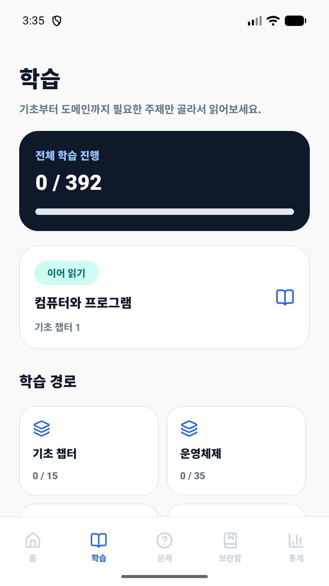
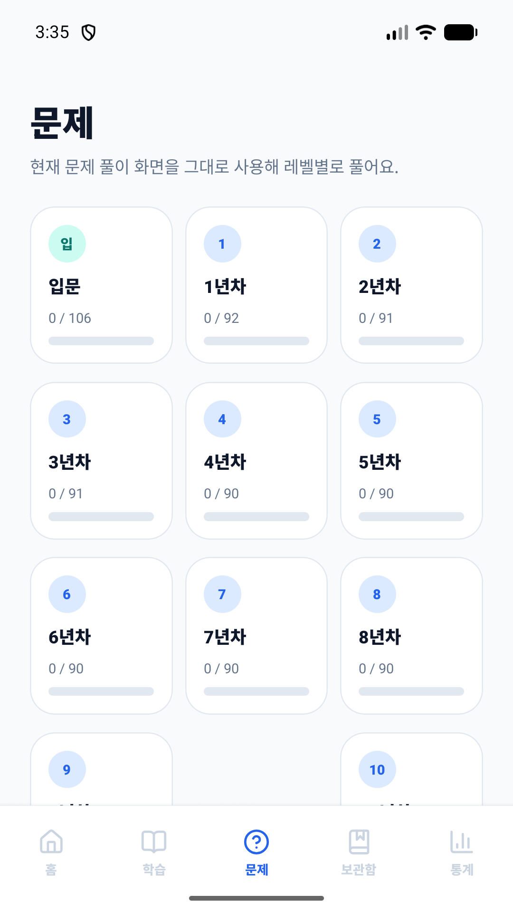
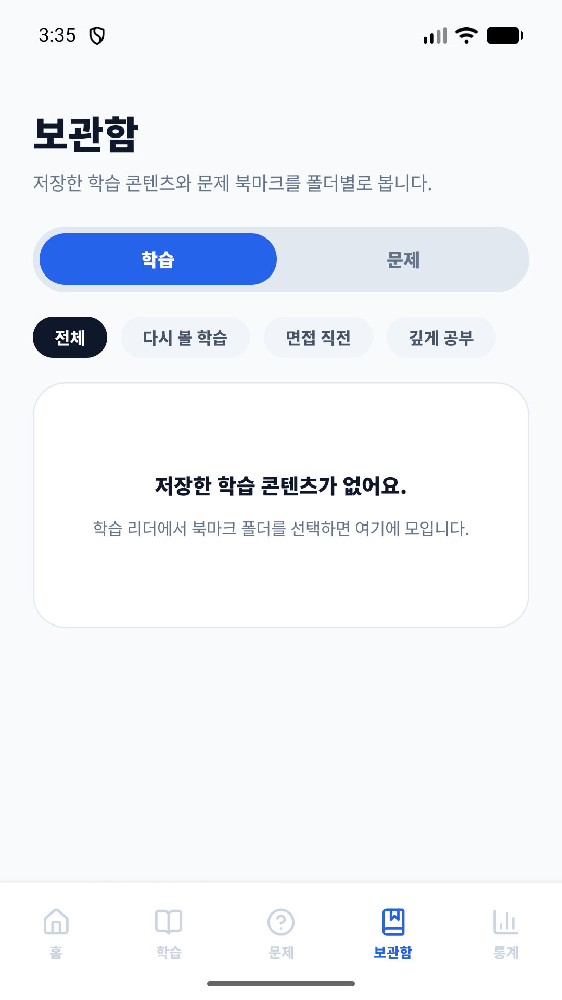
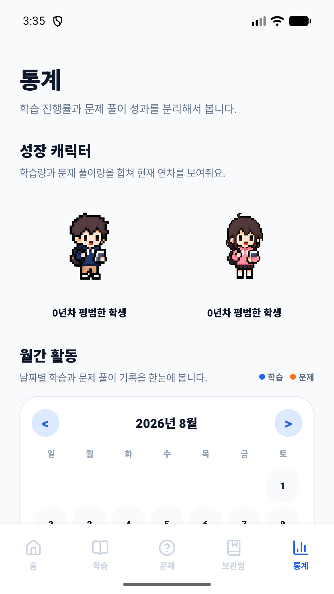
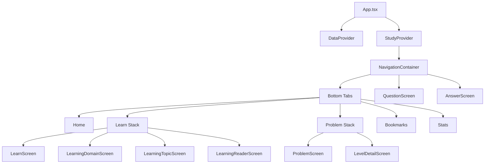
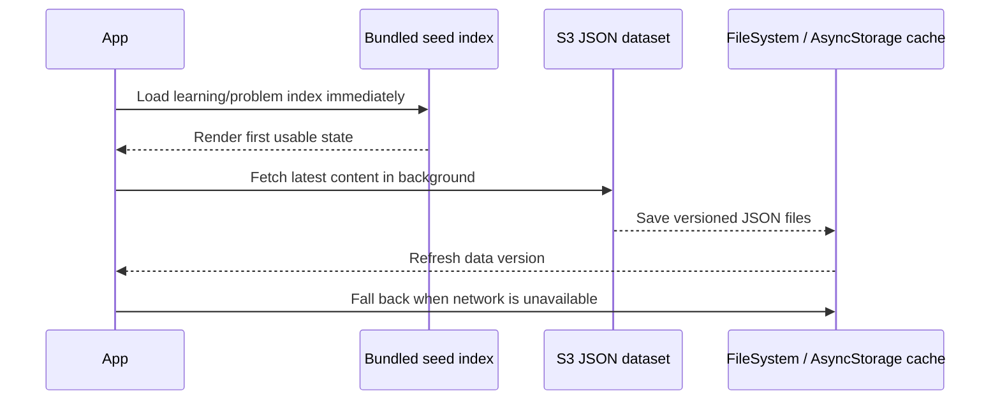

# BasiCS

Java/Spring 백엔드 개발자를 위한 CS 학습 앱입니다. 개념 학습, 면접형 문제 풀이, 북마크, 학습 통계를 한 흐름으로 묶어 “읽고 끝나는 CS”가 아니라 다시 꺼내 보고 점검할 수 있는 모바일 학습 경험을 목표로 만들었습니다.

## Screenshots

| Learning | Problems | Bookmarks | Stats |
| --- | --- | --- | --- |
|  |  |  |  |

## What It Does

- **CS 개념 학습**: 운영체제, 네트워크, 데이터베이스, 보안, 성능, 신뢰성 등 백엔드 면접과 실무에 가까운 주제를 단계별로 학습합니다.
- **경력 단계별 문제**: 입문부터 10년차까지 난이도와 관점을 나누어 질문을 탐색하고 답변을 확인합니다.
- **Mermaid 기반 다이어그램**: 복잡한 흐름은 텍스트만이 아니라 구조도와 단계형 설명으로 이해할 수 있게 구성했습니다.
- **학습 상태 저장**: 문제 상태, 북마크, 학습 완료 기록, 연속 학습일을 로컬에 저장합니다.
- **오프라인 친화 데이터 로딩**: 앱에 포함된 seed index를 먼저 보여주고, 원격 JSON과 로컬 캐시를 백그라운드에서 동기화합니다.

## Tech Stack

| Area | Stack |
| --- | --- |
| App | Expo, React Native, TypeScript |
| Navigation | React Navigation Bottom Tabs, Native Stack |
| Storage | AsyncStorage, Expo FileSystem |
| Visualization | Mermaid, react-native-svg, WebView |
| Monetization | react-native-google-mobile-ads |
| Build | Android native project, Gradle, custom APK build scripts |

## App Structure



## Data Loading Flow



## Project Layout

```text
src/
  App.tsx                    # Navigation root and providers
  components/                # Shared UI: cards, chips, progress, diagrams
  data/                      # Seed index, remote sync, cache loaders
  screens/                   # Home, learning, problems, answer, stats, bookmarks
  state/                     # Study progress and bookmark state
  theme.ts                   # Shared color/radius tokens

release/
  phone-screenshots/         # Portfolio screenshots
  README.txt                 # APK release notes

scripts/
  build-apk.js
  build-apk-fast.js
```

## Design Notes

- **빠른 첫 화면**: 전체 학습 JSON을 기다리지 않고 seed index를 먼저 로딩해 앱 진입 시간을 줄였습니다.
- **캐시 우선 복구**: 원격 데이터 로딩에 실패하면 이전에 저장된 JSON 캐시를 사용해 학습 흐름을 유지합니다.
- **레벨 중심 탐색**: 문제 데이터는 입문~10년차 레벨로 나누어 사용자가 자신의 현재 위치에 맞춰 접근할 수 있게 했습니다.
- **학습과 문제의 분리**: 개념을 읽는 흐름과 답변을 연습하는 흐름을 탭/스택 단위로 분리해 반복 사용성을 높였습니다.

## Getting Started

```bash
npm install
npm run start
```

Android 실행:

```bash
npm run android
```

타입 체크:

```bash
npm run typecheck
```

APK 빌드:

```bash
npm run build:apk
```

## Environment

AdMob 값과 릴리즈 서명 파일은 Git에 포함하지 않습니다.

```text
.env
release/signing-backup/
*.keystore
*.jks
release-signing.properties
```

필요한 환경 변수 예시는 아래와 같습니다.

```text
ADMOB_ANDROID_APP_ID=
ADMOB_IOS_APP_ID=
EXPO_PUBLIC_ADMOB_BANNER_ID_ANDROID=
EXPO_PUBLIC_ADMOB_BANNER_ID_IOS=
```

## Portfolio Highlights

- React Native 앱에서 학습 콘텐츠, 문제 풀이, 통계, 북마크를 하나의 사용자 여정으로 설계
- seed data, remote JSON, local cache를 조합한 데이터 동기화 구조 구현
- Mermaid 다이어그램을 모바일 화면에서 보여주는 학습 보조 UI 구성
- Android 릴리즈 빌드와 서명 파일 관리 흐름 정리
